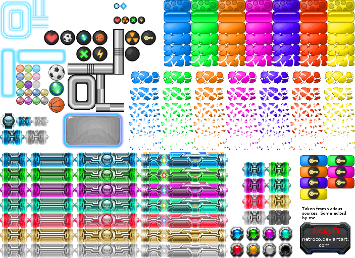

# Stage de Loris

## Introduction

Le but de cette page est de laisser quelques notes sur des points que nous allons aborder ensemble durant le stage.

Le but du stage est de faire un petit jeu sympa en python. Bien sur, on ne va pas developper un jeu compliqué qui demande beaucoup de travail et de temps. On fait un jeu faisable en 5 jours. Ce sera de la 2D, et on va utiliser une librairie de jeu en python simple à utiliser. J'ai fait des tests avec plein de lib et je propose qu'on utilise `pyglet`. C'est une librairie assez simple pour notre besoin

Dans chaque section, je mettrai une `checklist`, la liste des étapes que tu dois faire.

PS: je n'ai pas l'habitude de faire des doc en Francais, du coup désolé pour le manque d'accents/cédilles... sur les mots francais


 -----------


## Installation des outils
Afin de rendre le travail le plus ergonomique possible, on va utiliser les meme outils pour ce projet.


### **IDE**
  * Nom: `vscode`
  * Download: https://code.visualstudio.com/ 
  * Plugins:
     * `pylance`
     * `python`


  * Il faut installer `vscode`. Ca ne devrait pas etre difficile pour toi, meme sous windows. 
  * En revanche pour installer les plugins, il te faudra appuyer sur `Ctrl+Maj+x` et tapper `pylance` et cliquer sur `installer`. Faire de meme pour le plugin `python`

*   Checklist:
     - [] Download `vscode`
     - [] Installation `vscode`
     - [] Installation plugin `pylance`
     - [] Installation plugin `python`

 

### **Language**
  * **Nom**:  `Python`:
  * **Installation**: je te laisse faire, choisis la derniere version de python 3.x
  * Une fois l'installation de python faite: 
      * lance `vscode`, 
      * presse `Ctrl+Maj+²`, 
      * Un terminal apparait, vérifie que python est bien installé en tappant
        * ```bash
          python3 --version
          ```
        * La console devrait afficher quelque chose du genre `Python 3.10.6`
  
### **Environement virtuel**
  * On va se passer d'environnement virtuel pour le moment, et on va installer la lib `pyglet` de facon globale.
  * Pour installer la librairie `pyglet`, on va utiliser `pip` (= `Prefered Installer Program`), l'installeur standard des packages `python`. Du coup, pour instaler `pyglet` tapper dans le terminal:
    * ```bash
      pip install pyglet --user
      ```
    * Normalement tout devrait bien se passer, vérifie bien que qu'il est écrit que le package est bien installé.

-----------
## Construction du projet

Maintenant que la partie "`dev-ops`" est faite, on va pouvoir se consacrer à la partie programmation.


### Construction du squelette de travail
On va commencer par créer le squelette pour notre jeu. On va avoir besoin de créer une fenetre, afficher des images/animations, recupérer les evenements de la souris, et des infos de debuggage
On a le choix entre `programmation orienté objet`, et `programmation fonctionelle`. Vu que la `programmation orienté objet` demande des connaissances en architecture, on va commencer avec de la `programmation fonctionnelle`.


Dans n'importe qu'elle situation, tu peux (et tu dois) consulter la documentation de `pyglet`, très bien faite, ici:
https://pyglet.readthedocs.io/en/latest/


### Exercice 1: 
 * Lire la doc de Hello World ici:
   * https://pyglet.readthedocs.io/en/latest/programming_guide/quickstart.html#hello-world
   * Créer un script qui
      * crée une fenetre
      * affiche dans la console la position de la souris, a chaque fois que celle ci bouge:
      ```mouse event: positionX=xxx, positionY=xxx``` avec xxx a remplacer bien sur par la vraie position de la souris
      * ainsi que les evenements click gauche et droit:
      ```mouse event: click.LEFT``` ou ```mouse event: click.RIGHT```
  * Tu devrais avoir quelque chose qui ressemble a ceci: 
  * Bien sur, quand tu bouges la souris ou que tu clicks sur la souris, l'evenement doit etre affiché dans le terminal
  * Nomme le fichier `exercice1.py` et envoie le moi sur discord.

----------
### Exercice 2:
 * En lisant la doc sur les images et les sprites ici: https://pyglet.readthedocs.io/en/latest/programming_guide/image.html
 * En partant de `exercice1.py`
 * Récupere cette image 
   * Alors cette image peut paraitre assez bizzare, mais si tu regardes bien, elle contient plein de sous images qui representent des éléments du jeu. C'est notre base de données d'images en quelque sorte.
 * La copier dans le meme repertoire que ton script python
 * Afficher cette image en utilisant `pyglet`. Pour cela tu devras créer une image, puis un sprite qui utilise cette image créé
 * Tu devrais avoir quelque chose du genre 
 * Nomme le fichier `exercice2.py` et envoie le moi sur discord

----------
### Exercice 3:
 * L'idée de cet exercice, c'est d'afficher juste un morceau de l'image de l'exercice2, notre raquette. Cela doit ressembler a ceci 
 * Ceci represente la raquette dans le jeu
 * Pour cette exercice, cherche ou se trouve la raquette dans l'image `neon_version.png`
    * Tu peux lancer l'exercice2, et regarder les coordonnées de la souris pour connaitre les coordonnées et les dimensions de la raquette, tu en auras besoin pour recuperer la bonne region de l'image.
    * Le sprite qui contient la raquette doit s'appeler `racket` (on en aura besoin plus tard)

-----------
### Exercice 4:
 * Ca y est, on va commencer a interagir avec le jeu.
 * L'idée, c'est que, quand tu bouges la souris, la raquette bouge sur l'axe horizontal
 * Dans la methode `on_mouse_motion`, rajouter la ligne
    * ```racket.x = x```
    * Lancer le script et bouger la souris
    * Normalement, ca y est, tu bouges la racket dans le jeu
----------
### Exercice 5:
 * On va rajouter la balle
 * Choisis une balle dans l'image `neon_version.png`.
 * Créé son sprite correspondant. Appelle le sprite `ball`
 * Affiche le sprite `ball` pile poil au milieu de la raquette
 * Bien sur, quand la raquette bouge, la balle doit rester au milieu de la raquette.
 * Tu devrais avoir quelque chose qui ressemble a ceci 

----------
 ### Exercice 6:
  * On va faire bouger la balle.
  * L'idée, c'est que, quand on click souris gauche, ça lance la balle vers le haut et vers la gauche
  * Utiliser la fonction `update()` telle que definie dans https://pyglet.readthedocs.io/en/latest/programming_guide/image.html

---------
### Exercice 7:
  * Quand la balle arrive au coté gauche de la fenetre, il faut qu'elle rebondisse vers la droite.
    * Idem pour en haut, ca doit rebondir vers le bas
    * Idem pour la droite, ca doit rebondir vers la gauche
    * Idem pour quand la balle touche la raquette

---------
### Exercice 8:
  * On va faire une passe de graphisme, pour que le jeu soit beau
  * Rajouter un fond au jeu. Pour cela, on va rajouter l'image bac_upscaled.png 
  * N'oublie pas que, dans la methode `on_draw()`, si tu dessines d'abord la raquette, puis le fond, ben tu ne verras plus la raquette....Tu dois dessiner d'abord le fond, puis la raquette et la balle. L'ordre est important
  * Changer la resolution de la fenetre pour quelle affiche bien l'image en entier. L'image fait 1002 pixel de large, et 768 pixel de hauteur. Pour rappel, si tu te souviens de la doc du hello world, tu peux donner les dimensions de la fenetre au moment ou tu appelles son constructeur
  
      ```python
       win = window.Window(height=768, width=1002)
       ```
  * Tu devrais avoir quelque chose qui ressemble a ceci 

----------------

### Exercice 9:
 * On va rajouter la notion de vitesse a la balle, parce qu'elle est trop lente.
 * Rajouter les propriétés `ball.directionX` et `ball.directionY` à la balle.
 * `ball.directionX` est la vitesse de la balle sur l'axe X
 * `ball.directionY` est la vitesse de la balle sur l'axe Y
 * Joue avec la vitesse et choisi la vitesse qui te convient
 
 ----------------
### Exercice 10:
 * Et si on rajoutait des briques a casser ? On va commencer par en ajouter une seule
 * Dans l'image `neon_version.png`, choisi une brick et affiche la dans le jeu
 * Tu devrais avoir quelque chose comme ceci: 
 * j'ai choisi une brick jaune
 * note dans un coin la taille x et y de la brique

--------------
## Exercice 11:
 * Il faut maintenant gerer les collisions entre la brique et la balle, c'est a dire que notre jeu doit savoir si la balle est en train d'entrer en collision avec la brique.
 * pour cela on va preparer le terrain, c'est a dire qu'on va modifier notre code pour faire des tests
 * L'idée, c'est de pouvoir modifier la position de la raquette de maniere a la positionner facilement avec la souris, histoire de faire des tests de collision facilement, comme sur l'image suivante. Du coup, quand je bouge la souris, la raquette se met a la position de la souris, comme ceci:
 
  *
 * on en profite pour faire en sorte que bouton droit de la souris=on remet la balle sur la raquette
 * comme ca, il suffit de faire un click gauche sur la souris quand la raquette est juste dessous la brique pour faire notre test de rebond/collision
 ------------
 ## Exercice 12:
 
  * Ceci est potentiellement la partie la plus difficile du projet, elle va etre étalée en plusieurs exercices. Il s'agit de coder les collisions entre la balle et la brique: Tu dois reussir a trouver quand est ce que la balle entre en collision avec la brique. Car quand la balle entrera en collision avec la brique, on veut faire rebondir la balle, casser la brique.... bref donner un comportement sympa au jeu.

  * Du coup, tu dois ecrire une fonction:
   ```py
   def is_colliding(object1, object2):
   ```
   qui prend en parametres 2 objets. Si ceux ci entrent en collision, elle retourne `True`. Si les objets ne rentrent pas en collision, elle  retourne `False`. Bien sur, en l'occurence, les 2 objets sont la balle et la brique
  * Réfléchit a une solution, code la, et envoie la moi. C'est normal si tu cherches, c'est normal si tu commences a utiliser des notions de trigonométrie que tu as appris en classe. Aussi, n'hésite pas a chercher sur internet bien sur, des centaines de personnes se sont pris la tete sur ce sujet avant toi :)
  * Alors pour info, ceci est l'exercice parfait pour te montrer le metier de l'ingenieur en programmation. Tu as un besoin la en ce moment, c'est a toi de faire un zoom arriere sur ce que tu es en train de faire, de comprendre ton probleme, de l'analyser, et d'y trouver une solution. Trouver la solution est juste la derniere étape, les étapes d'avant étant de **trouver** ton probleme, de l'**analyser**, puis **chercher une solution** :)
  * Ne regarde pas le prochain exercice avant de trouver une solution. Le but de l'exercice, c'est justement que de toi meme, tu recherches une des solutions.
  * Rappel: chaque sprite possède les propriétés suivantes:
  ```python
    sprite.x
    sprite.y
    sprite.width
    sprite.height
  ```
  avec `sprite.x` et `sprite.y` representant le point en bas a gauche du sprite, et `sprite.x+sprite.width` et `sprite.y+sprite.height` representant le point en haut a droite du sprite.

------------

## Exercice 13:
Dans cet exercice, je te propose de te donner une des solutions qui existe pour resoudre l'`exercice12`. Alors, pour que les choses soient claires, il existe plusieurs solutions qui mettent en jeu des notions de math, parque la balle est ronde, et la brique est rectangulaire. Dans un soucis de simplicité, je vais completement éviter ces solutions (meme si elles peuvent etre plus 'precises'). Je vais éviter de rentrer dans le piege des maths, car il existe des solutions math niveau 4ème jusqu'à BAC+2... alors que, au final, on peut solutionner ce probleme sans math.
 * Comme tu sais, la balle est ronde, et la brique est rectangulaire, mais avec des bords arrondis. Ta mission est de trouver un moyen de savoir, au niveau de ton programme, si la balle ronde entre en collision avec la brique (car au final, tu veux faire rebondir la balle sur la brique, mais bien sur la faire rebondir dans la bonne direction)
 * Pour cela, on va introduire la notion de `bounding_box`. Il s'agit d'entourer ton objet, la balle, d'une boite la plus petite possible mais qui engloble ta balle. En gros, regarde la `bounding_box` representée en vert sur l'image suivante: 
 * On va aussi entourer notre brique d'une `bounding_box`. Du coup, maintenant, pour calculer les collisions entre 2 box, c'est beaucoup, beaucoup plus simple
 * Du coup, le but de l'exercice, c'est de rajouter une `bounding_box` à la balle et une `bounding_box` a la brique. Quand la balle touche la brique, tu dois faire un print `collision!!`
    * Pour coder cette function, tu as tous les éléments ici: 
    * Regarde bien la partie hachurée en vert, c'est la partie qui est en collisions entre la bouding_box de la balle et la bounding_box de la brique.

------------
 ## Exercice 14:
   * Maintenant qu'on sait si la balle entre en collision avec la brick, est ce qu'on sait la faire rebondir ?
   * Essaie de faire rebondir la balle sur la brique. Teste toutes les directions et collisions possibles

------------
## Exercice 15:

   * Pour solutionner le probleme de l'exercice14, au moment de la collision entre la balle et la brique, l'idée, c'est que tu te debrouilles pour connaitre ou se passe la collision: a gauche de la brique ? en haut de la brique ? en bas ? Du coup, quand tu regardes ton code actuel, tu connais la trajectoire de la balle. Tu sais si elle est en train de monter, de descendre, d'aller vers la gauche ou la droite (souviens toi, on a appelé ca `ball.directionX` et `ball.directionY` ). Du coup, quelle info te manque t il pour savoir dans quel sens la balle va rebondir ?
   * Au final, l'info qui te manque, c'est de savoir si la balle est en train d'etre en collision avec la gauche, et/ou le haut, et/ou le bas et/ou la droite de la brique.
   * Ton besoin, c'est donc de créer une fonction qui va repondre a cette question: la balle est en train de toucher quel(s) coté(s) de la brique ?
   * On a deja codé une function qui test si 2 objets entre en collision: `is_colliding(object1, object2)`
     * L'astuce, c'est de coder 4 zones dans une brique: une zone `haut`, une zone `bas`, une zone `gauche` et une zone `droite`. Chaque zone sera une `bounding_box`, l'image ci suivante: 
     * on a deja codé la fonction ```is_colliding(object1, object2)```. Si on appele cette function pour vérifier la collision entre la balle et chacun des 4 cotés de la brique, alors on sait exactement ou la collision a lieu.
   * Afficher dans les traces, l'endroit ou a lieu la collision (down, up, left, right) entre la balle et la brique

------------
## Exercice 16:
  * Bon ben ca y est, on peut faire rebondir la balle.
  * Faire rebondir la balle

------------

## Exercice 17:
  * Rajouter des points de vie a la brique.
  * Donner 5 point de vie a la brique. A chaque fois que la balle touche la brique, ca lui enleve 1 point de vie
  * Afficher dans les traces de logs a chaque fois que la brique perd 1 point de vie


------------
## Exercice 18:
  * On va maintenant dessiner une carte de brique qui representera un niveau. Pour cela, on va utiliser le format texte, tout simplement. On va dessiner, au format texte, les niveaux. Chaque brique est representée par 2 lettres: la premiere lettre est la couleur, la deuxieme represente ses points de vie. Ainsi, si on marque 
    * `J1`, cela represente une brique jaune(`J`) avec `1` point de vie
    * `R3`, cela represente une brique rouge(`R`) avec `3` points de vie

    Example:

    ```
    J3J3J3J3J3J3  R2R2R2R2
    R3R3R3R3R3R3  J2J2J2J2
    J3J3J3J3J3J3  R2R2R2R2
    ```
   * Faire un nouveau script python qui prend pour chaine la variable carte qui vaut
   ```python
    carte="""
J3J3J3J3J3J3  R2R2R2R2
R3R3R3R3R3R3  J2J2J2J2
J3J3J3J3J3J3  R2R2R2R2
    """
  ```
   * faire une function qui prend en parametre la carte, et qui retourne chaque element de la carte, mais dans une liste de liste. Un pretty print de cette function donnera pour notre variable `carte`:
   ```
   [[],
 ['  ', 'J3', 'J3', 'J3', 'J3', 'J3', 'J3', '  ', 'J2', 'J2', 'J2', 'J2'],
 ['  ', 'J3', 'J3', 'J3', 'J3', 'J3', 'J3', '  ', 'J2', 'J2', 'J2', 'J2'],
 ['  ', 'J3', 'J3', 'J3', 'J3', 'J3', 'J3', '  ', 'J2', 'J2', 'J2', 'J2'],
 ['  ']]
   ```

------------
## Exercice 19:

 * Coder la function qui dessine, graphiquement, la carte suivante:
 ```python
carte="""
J3J3J3J3J3J3  J2J2J2J2
J3J3J3J3J3J3  J2J2J2J2
J3J3J3J3J3J3  J2J2J2J2
 """
 ```
   * Tu devrais avoir le résultat suivant 


## Exercice 20:
 * Rajouter les collisions entre la balle et les briques pour que la balle rebondisse sur les briques

## Exercice 21:
 * Tuer les briques quand elles n'ont plus de points de vie.

## Exercice 22:
 * Ecrire le niveau dans un fichier texte, le charger, et jouer


## Exercice 23:
 * On va dire que le jeu est terminé. Bien sur, il resterait a rajouter les bruitages, le score, perdre quand la balle tombe dans le vide, charger la carte suivante quand la carte actuelle est chargée....mais ca, je te laisse prendre l'initiave de le continuer si tu en as envie.
 * Maintenant que le jeu est pseudo terminé, il est temps de faire une passe sur le code. Pour tout te dire, même si le code à le mérite de fonctionner, il est vraiment hideux. C'est pas grave, cet exercice est la pour faire un peu propre. 
 * Maintenant que le jeu est terminé, on peut voir dans le code les acteurs, leurs interactions. On a maintenant une premiere experience qui va nous permettre de faire un code un peu plus propre, sans trop avancer dans les fonctionnalités de python.

Si tu veux continuer, tu as plein de pistes. Pour info, pyglet supporte les collisions. Nous, on les a fait a la main car je voulais que tu fasse l'exercice de chercher comment coder des collisions.


